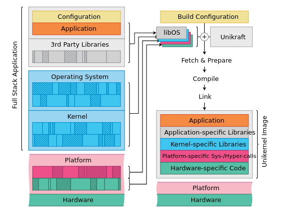
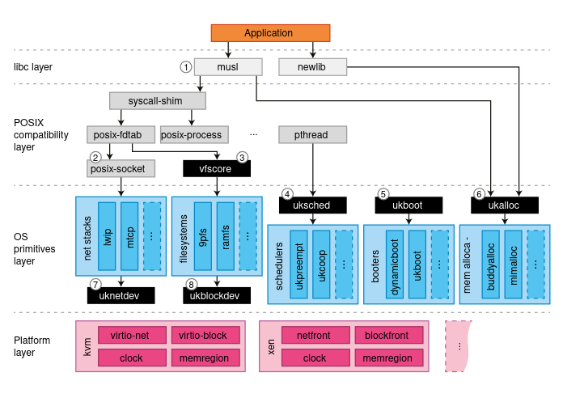

# Unikraft GSoC'22: Shadow Stack

The current implementation aims to bring the compiler based, LLVM `ShadowCallStack` to Unikraft apps.

What makes this project so different from other approaches is the complexity of the platform it targets.
Unikraft, a Unikernel Development Kit, provides applications which run in a single address space, the separation between user mode and kernel mode becoming, practically, nonexistent.

Thus, traditional means of using the compiler based `ShadowCallStack` can not be applied to Unikraft images.
More exactly, providing a runtime (not yet supported by LLVM's `compiler-rt`) for this security mechanism can not follow the path of using, for instance, the `arch_prctl` syscall, very nicely documented [here](https://gist.github.com/moyix/f2e101348209ddeb7eba903147a867aa).

Moreover, what's really so interesting about Unikraft is the ability of building images for a plethora of architectures and platforms, ergo, the initial goal of my GSoC project (Shadow Stack for `AArch64` based apps) could easily come to light while maintaning separation and modularity.

Following this idea, what had to be accomplished was modifying the bootstraping process (provided by the `ukboot` internal library), by inserting a constructor, whose sole purpose was to initialize the `x18` register with the protected stack.

Nevertheless, for more complex apps, such as `SQLite`, `Redis` and `Nginx` (already ported to Unikraft), initializing `x18` means altering the scheduling implementation (found in the `uksched` and `ukschedcoop` internal libraries), as multithreading becomes the norm.

## GSoC contributor

Name: Maria Sfiraiala

Email: <maria.sfiraiala@gmail.com>

Github profile: [mariasfiraiala](https://github.com/mariasfiraiala)

## Mentors

[Razvan Deaconescu](https://github.com/razvand)

[Vlad Badoiu](https://github.com/vladandrew)

## Main Contributions

## Sidequests

## Roadmap

## Blog posts

## Documentation

## Current status

## Future work

## Main take aways